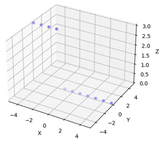
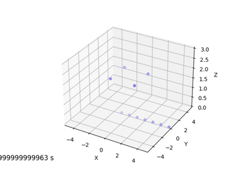

# Swarm-UAV 

## Installation
- This project is developed in crazyswarm (see: https://crazyswarm.readthedocs.io/en/latest/index.html)
- Firstly you should install Ros (see: https://www.ros.org/)
- Then you should install crazyswarm. We will use just python api.

### How to install Crazyswarm for just Python API 
(https://crazyswarm.readthedocs.io/en/latest/installation.html)

1- __Set enviroment veriable__
```
$ export CSW_PYTHON=[python2 or python3]
```
2- __Install depencies__
```
$ sudo apt install git make gcc swig lib${CSW_PYTHON}-dev ${CSW_PYTHON}-numpy ${CSW_PYTHON}-yaml ${CSW_PYTHON}-matplotlib
```
3- __Clone Repo__
```
$ git clone https://github.com/USC-ACTLab/crazyswarm.git
```
4- __Run build script__
```
$ cd crazyswarm
$ ./buildSimOnly.sh
```


<center>
   
  
</center>
